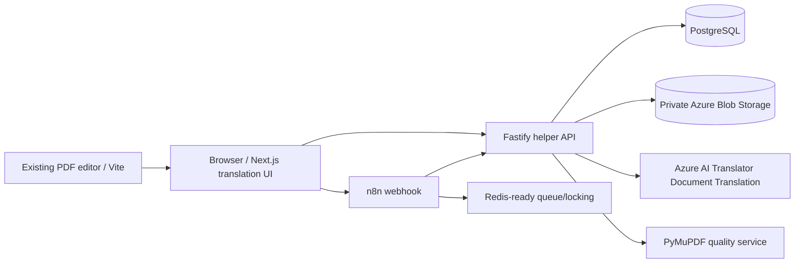

# updateMyPDF

updateMyPDF, mevcut PDF editörünün yanında PDF ve DOCX belgelerini Azure AI Translator Document Translation ile çeviren belge işleme katmanını da içerir. Çeviri sonucu mümkün olduğunca kaynak düzeni, tabloları, görselleri ve metin yerleşimini korur; son çıktı PyMuPDF tabanlı kalite servisiyle kontrol edilir.

## Mimari



Ana klasörler:

```text
/apps/web             Next.js App Router çeviri arayüzü
/apps/api             Fastify helper API, Azure adapterları ve job state machine
/services/pdf-quality PyMuPDF kalite kontrol servisi
/n8n/workflows        Import edilebilir n8n workflow JSONları
/infra                Azure setup ve production reverse proxy örnekleri
/scripts              Windows PowerShell yardımcı komutları
/docs                 Deployment ve operasyon notları
```

Mevcut root Vite/Express PDF editörü korunur. `VITE_TRANSLATION_APP_URL` verilirse üst menüdeki **Belge çevir** bağlantısı yeni Next.js arayüzünü açar.

## Gereksinimler

- Node.js 20+
- npm
- Docker Desktop + Docker Compose
- Python 3.11+ (kalite servisini Docker dışında çalıştıracaksan)
- Azure CLI (gerçek Azure bağlantısı için)

## Yerel mock modunda çalıştırma

Gerçek Azure hesabı olmadan tüm uçtan uca akış çalışır. Mock translator kaynak dosyanın güvenli kopyasını sonuç olarak kullanır; bu, state machine, storage, download ve kalite kontrolünü test etmek içindir.

```powershell
Copy-Item .env.example .env
.\scripts\setup.ps1
docker compose up -d --build
```

Adresler:

- Web: `http://localhost:3000`
- Helper API: `http://localhost:4000/health`
- Quality API: `http://localhost:8000/health`
- n8n: `http://localhost:5678`
- Mevcut PDF editörü: `npm run dev` ile `http://localhost:5173`

Mock dışında yalnızca API’yi çalıştırmak için:

```powershell
$env:TRANSLATION_MOCK = 'true'
npm --prefix apps/api run dev
```

## Azure Portal kurulumu

Azure Document Translation için `S1 Standard` Translator kaynağı ve custom domain endpoint gerekir; Free tier Document Translation için uygun değildir. Kaynak ve hedef Blob container’ları private olmalıdır.

```powershell
az login
.\infra\azure-setup.ps1 -ResourceGroup updatemypdf-rg -Location eastus
```

Script mevcut kaynakları silmez; yalnızca yoksa oluşturur. Oluşan kaynaklar:

- `translation-source`
- `translation-target`
- `translation-quarantine`

Translator API versiyonu merkezi olarak `AZURE_TRANSLATOR_API_VERSION=2026-03-01` değerindedir. Synchronous endpoint tek dosyayı doğrudan multipart alır; batch endpoint Blob SAS URL’leri ile asenkron iş başlatır. Ayrıntılar: [Microsoft Document Translation REST guide](https://learn.microsoft.com/en-us/azure/ai-services/translator/document-translation/latest/rest-api/guide-overview), [synchronous translation](https://learn.microsoft.com/en-us/azure/ai-services/translator/document-translation/latest/quickstarts/synchronous), [batch API](https://learn.microsoft.com/en-us/azure/ai-services/translator/document-translation/how-to-guides/use-rest-api-programmatically).

### RBAC

Production’da API için managed identity kullanılması önerilir:

- Storage account üzerinde `Storage Blob Data Contributor`
- User Delegation SAS üretimi için gerektiğinde `Storage Blob Delegator`
- Translator kaynağına API çağrısı için Translator key veya Entra tabanlı erişim modeli

Azure key, SAS URL ve authorization header hiçbir zaman browser’a, n8n JSON’una veya loglara yazılmaz.

## Environment variables

Tam liste `apps/api/.env.example` ve root `.env.example` içindedir. Önemli değerler:

```env
TRANSLATION_MOCK=false
DATABASE_URL=postgresql://...
AZURE_TRANSLATOR_ENDPOINT=https://<resource>.cognitiveservices.azure.com
AZURE_TRANSLATOR_KEY=server-only-secret
AZURE_TRANSLATOR_API_VERSION=2026-03-01
AZURE_STORAGE_ACCOUNT_NAME=...
AZURE_USE_ENTRA_ID=true
SOURCE_SAS_TTL_MINUTES=30
TARGET_SAS_TTL_MINUTES=60
DOWNLOAD_LINK_TTL_MINUTES=15
MAX_UPLOAD_SIZE_MB=20
MAX_PDF_PAGES=50
FILE_RETENTION_HOURS=24
```

`AZURE_STORAGE_CONNECTION_STRING` yalnızca yerel fallback’tir. Production varsayılanı `DefaultAzureCredential` + managed identity’dir.

## API

`apps/api` endpointleri:

```text
GET    /health
GET    /ready
POST   /api/v1/uploads
POST   /api/v1/jobs/:jobId/start
GET    /api/v1/jobs/:jobId
POST   /api/v1/jobs/:jobId/poll       internal
GET    /api/v1/jobs                   internal
GET    /api/v1/jobs/:jobId/events
GET    /api/v1/jobs/:jobId/download-link
GET    /api/v1/jobs/:jobId/download
DELETE /api/v1/jobs/:jobId
POST   /api/v1/cleanup                internal
```

Upload form alanları: `file`, `sourceLanguage` (`auto` olabilir), `targetLanguage`, `preserveLayout`.

Örnek PowerShell:

```powershell
$form = @{
  file = Get-Item .\sample.pdf
  sourceLanguage = 'auto'
  targetLanguage = 'tr'
  preserveLayout = 'true'
}
$upload = Invoke-RestMethod -Uri http://localhost:4000/api/v1/uploads -Method Post -Form $form
Invoke-RestMethod -Uri "http://localhost:4000/api/v1/jobs/$($upload.jobId)/start" -Method Post
Invoke-RestMethod -Uri "http://localhost:4000/api/v1/jobs/$($upload.jobId)" -Method Get
```

State machine:

```text
received → validating → uploaded → submitted → translating
→ downloading → quality_check → completed / completed_with_warnings
```

Her geçiş `translation_job_events` tablosuna yazılır. Geçersiz geçişler reddedilir. Aynı isteğin güvenli şekilde tekrar gönderilmesi gerekiyorsa `Idempotency-Key` header’ı kullanılabilir; kullanıcı aynı dosyayı yeniden yüklediğinde yeni bir çeviri işi oluşturulur.

## n8n workflow import

Dosyalar:

- `n8n/workflows/01-translation-submit.json`
- `n8n/workflows/02-translation-status-poller.json`
- `n8n/workflows/03-cleanup-expired-files.json`
- `n8n/workflows/04-failure-notification.json`

Manuel import:

1. `http://localhost:5678` aç.
2. Import from File ile dört JSON dosyasını tek tek içeri al.
3. HTTP Request node’larına internal header credential veya expression bağla.
4. `TRANSLATION_API_URL=http://api:4000` ve `INTERNAL_API_SECRET` değerlerini n8n environment’ına ekle.
5. Status poller ve cleanup workflow’larını etkinleştir.

Otomatik import için `N8N_API_KEY` tanımlayıp:

```powershell
.\scripts\import-n8n-workflows.ps1
```

Workflow dosyalarına gerçek API key, credential ID veya SAS eklenmemiştir.

## Kalite kontrolü

`services/pdf-quality` şu kontrolleri yapar:

- kaynak/çıktı sayfa sayısı
- sayfa ölçüleri
- boş sayfalar
- olağan dışı metin kapsamı
- olası bbox taşmaları
- çok küçük fontlar
- kaynak ve çıktı metin bloklarında font ailesi, font boyutu ve kalın/italik stil eşleşmesi
- bozuk PDF

Kalite skoru `QUALITY_PASS_SCORE` ve `QUALITY_WARNING_SCORE` ile ayarlanır. Varsayılan olarak 90 üzeri başarılı, 70–89 arası uyarılı tamamlanır; ancak kritik katmanlardan biri (metin kapsamı, tipografi, sayfa yapısı, görsel varlık veya layout) düşükse skor en zayıf katmanı geçemez. `MIN_TEXT_CHAR_RATIO` varsayılan olarak `0.68`, `MIN_POSITION_COVERAGE` ise `0.98` değerindedir; metin kapsamı veya konumsal satır kapsamı zayıfsa eksik/metni kaymış çıktı başarılı sayılamaz.

## PDF preserve-layout modu

Azure gerçek modunda PDF dosyaları `preserve_pdf` akışını kullanır. Kaynak PDF görsel tuval olarak korunur; metin blokları ve koordinatları PyMuPDF ile çıkarılır, Azure Text Translation ile çevrilir ve aynı alanlara Unicode destekli fontla yeniden yazılır. DOCX/PPTX dosyaları mevcut Azure Document Translation akışında kalır.

Bu yaklaşım logoları, vektör çizimleri ve arka planı korur. Hedef dil bir metin kutusuna sığmazsa yalnızca o kutu küçültülür ve kalite raporuna yansır. Sayfa bütünlüğü yine de bozulursa tüm metinler aynı oranda kademeli olarak `%100, %97, %95, %93, %90, %86, %82, %78, %73, %68` ölçeklerinde yeniden render edilir; her aday PDF tekrar incelenir. Sayfa sayısı/ölçüsü, boş sayfa ve taşma kontrolleri önceliklidir; sonra en yüksek kalite skoru, eşitse en az küçültme seçilir. Sayfa zaten sağlamsa gereksiz global küçültme yapılmaz. Kalite uyarıları dosya indirmeyi engellemez.

Root PDF editöründeki metin değiştirme, yeniden yazma, yeni metin, watermark ve header/footer işlemleri de aynı `/adapt-text-layout` kalite endpoint’inden geçirilir. Bilinçli sayfa yapısı değişikliklerinde (ör. sayfa silme veya yeniden boyutlandırma) adaptif küçültme uygulanmaz.

Tipografi kontrolü gerçek görsel yüksekliği karşılaştırır. Kaynak font hedef dildeki karakterleri desteklemiyorsa kare karakter üretmek yerine stil uyumlu Unicode/condensed fallback kullanılır; bu durum teknik raporda `fontFallbackCount` olarak izlenir ve okunabilir çıktı başarısız sayılmaz.

## Test ve build

```powershell
.\scripts\test.ps1
```

Tek tek:

```powershell
npm run build
npm --prefix apps/api run build
npm --prefix apps/api test
python -m pytest -q services/pdf-quality
npm --prefix apps/web run build
```

## Production deployment

`infra/docker-compose.production.yml` ve `infra/Caddyfile` örneği Caddy TLS, private network, PostgreSQL, Redis, n8n, API, web ve quality servislerini içerir.

Production’da:

- TLS ve güvenlik header’ları zorunlu.
- n8n editor public olmamalı; VPN veya SSO arkasına alınmalı.
- `N8N_ENCRYPTION_KEY`, DB şifreleri ve API secret’ları secret manager’da tutulmalı.
- Azure Storage lifecycle policy ile 24 saatlik retention uygulanmalı.
- API kimliği Supabase/JWT veya gateway auth ile kullanıcıya bağlanmalı.
- Redis queue mode ve en az bir n8n worker kullanılmalı.
- Azure Document Translation S1 maliyeti ve karakter/görsel kullanım ölçülmeli.

Vercel kullanıyorsan mevcut root proje (`src` + Vite) PDF editörü olarak kalır. Çeviri arayüzü için ikinci bir Vercel project açıp **Root Directory = `apps/web`** seçebilirsin. `TRANSLATION_API_URL` değerini Render/Azure üzerindeki helper API URL’sine, `INTERNAL_API_SECRET` değerini API ile aynı server-only secret’a koy. `NEXT_PUBLIC_TRANSLATION_API_URL` boş bırakılırsa arayüz kendi same-origin proxy route’unu kullanır. API tarafını Render’da `apps/api` Dockerfile’ı ile veya Azure Container Apps/App Service üzerinde çalıştırabilirsin.

## Güvenlik

Dosya isimleri sanitize edilir, path traversal engellenir, PDF/DOCX magic bytes kontrol edilir, private Blob container kullanılır ve kısa süreli SAS üretilir. Belge içeriği, SAS ve sırlar loglanmaz. Rate limit açıktır. ClamAV entegrasyonu için `FileScanner` sınırı sonraki adımda eklenebilir.

## Bilinen sınırlamalar

- Gerçek Azure çevirisi için Azure hesabı, S1 Translator, Blob Storage ve RBAC gerekir.
- PDF düzeni mümkün olduğunca korunur ancak uzun çeviriler, taranmış belgeler, özel fontlar veya karmaşık text box’lar manuel kontrol gerektirebilir.
- Senkron çeviri tek belge içindir; büyük dosyalar batch yoluna gider.
- DOCX kalite kontrolü ilk MVP’de PDF kalite metriklerini kullanmaz.
- Mevcut PDF editörü Vite olarak korunmuştur; yeni çeviri arayüzü App Router ile `apps/web` altında ayrı deploy edilebilir.
- Kullanıcı kimliği ve Supabase job ownership bağlantısı production öncesi eklenmelidir; helper API’deki internal header yalnızca servisler arası erişim içindir.

## Sonraki mantıklı adım

Önce mock Docker akışını çalıştırıp örnek PDF ve DOCX ile doğrula. Ardından Azure kaynaklarını oluştur, `apps/api/.env` içine gerçek değerleri gir, `TRANSLATION_MOCK=false` yap ve `scripts/azure-check.ps1` çalıştır. Son testte aynı dosyanın düzeni, sayfa sayısı ve indirilen çıktısı karşılaştırılmalıdır.
